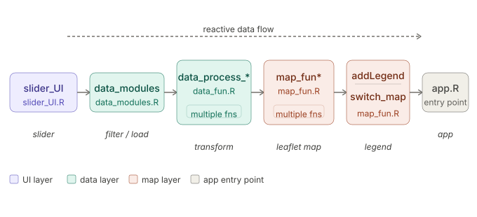

# Developer guide to adding new datasets to the JNCC visual tool

## Overview of app data handling
> [!NOTE]
> The datasets used in this app is not included in the repo.

## Basic logic of spatial explorer

## Steps to add new datasets to spatial explorer.

Download data from source. If you have the link to the dataset and working from a linux machine, create a folder for the dataset, navigate to it, and then run the following in the terminal: `wget <link_to_dataset>`

For each new dataset or dataset groups, 
1. Add a new slider UI function `*_sliders` for that dataset in `modules/slider_UI.R` 
2. Add a new data handling function `data_process_*` in `data_fun.R` 
3. For map data, add `map_fun_*` in `map_fun.R`
4. Add option to switch to that dataset in `switch_map` in `map_fun.R`.

Then in `data_modules.R`. Add call to these functions in the appropriate places. 
1. Add the new dataset as an option in `dat_choices_pt` in the module `datselect_mod_ui` (The name of the dataset will be shown in app and used for the rest of the app)
1. Add call to `*_sliders` in `output$ui_placeholder` in the module `datselect_mod_server`. This allows UI options to change dynamically
2. Add call to `data_process_` in `filtered_data` in the module `datselect_mod_server`. 
3. Add call to `map_fun_*` at ... (work in progress)




#### Example ("Predatory Bird Monitoring Scheme"):
- add function `pbms_slides` in `slider_UI.R`
- add function `data_process_pbms` in `data_fun.R`
- add function `map_fun_pbms` in `map_fun.R`
- add ifelse logic for PBMS data in function `swithc_map` in `map_fun.R` to handle map plotting and legend
```{R}
## data_modules.R pseudo code
dat_choices_pt <- c(..., 'Predatory Bird Monitoring Scheme')

## step 1: add dataset choice
datselect_mod_server <-  function(id) {
...
## step 2: add logic to render dataset-specific sliders
output$ui_placeholder <- renderUI({
      type <- req(input$data_choice)
      print(type)
      if (type == "EA pollution inventory 2021") {
        ea_pollution_sliders(id)
    ...
      } else if (type == "Predatory Bird Monitoring Scheme") {
        pbms_sliders(id)
      ...
      } else {
        p('The selected dataset will be added soon.')
      }
    })
}
 ## step 2b (optional, add dynamic UI elements of individaul datasets here, see:
    observeEvent(input$var_biota, {...})

## step 3: pass user choices to filter data, note table and plot tab reacts to this input
filtered_data <- reactive({
   ...
        } else if (type =="Predatory Bird Monitoring Scheme") {
          data_process_pbms(var_biota = input$var_biota, 
                            var_map_sgl = input$var_map_sgl)[[1]] %>% 
            filter(year >= input$year_slider[1], year <= input$year_slider[2])
  ...
    })

## step 4: plotting map (triggered by 'update map' button)

   (no need to add anything, logic in app.R)


```
